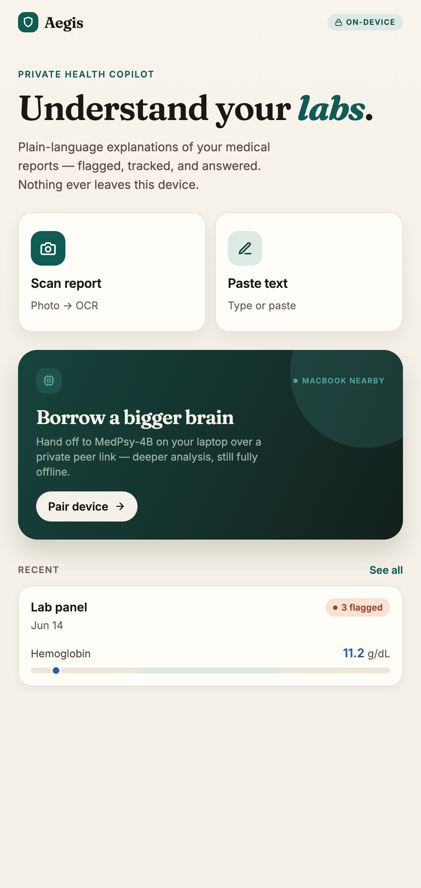
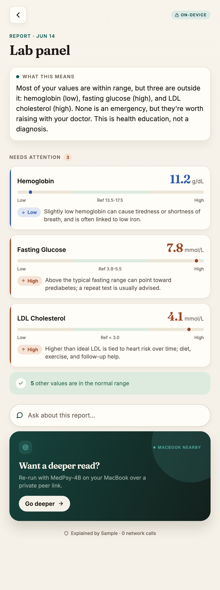
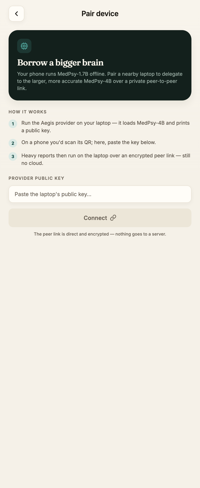

<div align="center">


# Aegis — Private, Offline Health Copilot

**Snap a photo of a lab report → it's read, explained in plain language, and flagged — entirely on your own device. Your medical data never leaves your hands.**

Built on [`@qvac/sdk`](https://www.npmjs.com/package/@qvac/sdk) for **QVAC Hackathon I — Unleash Edge AI**.
Apache-2.0 · Psy Models · Mobile · General Purpose · Build-in-Public

</div>

> ⚠️ Aegis is health **education**, not medical diagnosis. Always talk to a doctor.

<div align="center">

&nbsp;&nbsp;

&nbsp;&nbsp;

</div>

---

## Why

Lab reports are intimidating walls of numbers, and the obvious fix — pasting them into a cloud chatbot — means handing your most sensitive data (PHI) to someone else's servers. Aegis does the opposite: **every inference runs locally** through `@qvac/sdk`. The core flow works in airplane mode.

## What it does

- **Read** a lab report — paste the text today; on-device camera + `ocr()` on the roadmap.
- **Explain** it in plain language with on-device **MedPsy**, clearly framed as education, not a diagnosis.
- **Flag** out-of-range values **deterministically** — values, units and reference ranges are parsed exactly (never hallucinated), and each flag gets an accurate, offline explanation from a curated marker knowledge base.
- **Track** results as private, on-device records and **ask** follow-up questions across your history.
- **Borrow a bigger brain** (the signature feature): when a paired laptop is nearby, delegate the heavy reasoning to the larger **MedPsy-4B** over a direct, encrypted peer-to-peer link — still no cloud.

## How it works

```
            ┌────────────────────────── on device ──────────────────────────┐
report text │  parseLabReport()         knowledge base        @qvac/sdk LLM   │
   ──────────▶  exact values/ranges  +  per-flag education  +  MedPsy summary │
            │  (deterministic)          (deterministic)       (on-device)     │
            └───────────────────────────────┬───────────────────────────────┘
                                             │  optional, user-initiated
                                             ▼
                         Hyperswarm P2P  ──▶  laptop provider (MedPsy-4B)
                         (encrypted peer link between YOUR devices, no cloud)
```

- **Accuracy by construction.** The numbers, units and reference ranges come from a deterministic parser; the per-flag "what this means" comes from a curated knowledge base. The model only writes the holistic summary — so a small on-device model can never invent a value or a range.
- **Platform-split service.** `qvac.native.ts` runs real on-device MedPsy (with a manual delegate→local fallback on SDK codes `53701/53702`); `qvac.ts` is a templated preview so the whole UX is demoable in a browser. Metro selects the right one per platform.
- **Injection-safe prompts.** Report text is untrusted (it can be OCR of an arbitrary image), so it's sanitized and wrapped as data between delimiters the input can't forge — see `app/src/services/reasoning.ts`.
- **Honest provenance.** Each result shows where it ran. Local/preview results say "0 network calls"; a delegated result truthfully says "encrypted peer link · no cloud."

## Privacy & on-device

All AI inference (LLM, OCR, embeddings, RAG) runs locally via `@qvac/sdk`. There are **zero runtime remote AI calls** — see [`remote-apis.json`](remote-apis.json) for a full disclosure of every network call (all are one-time build/setup downloads). The only data that can leave the phone is during **user-initiated** P2P delegation, and then only to the user's *own* paired laptop over an end-to-end encrypted link.

## Verified status

- ✅ **On-device GPU inference confirmed** on a physical iPhone 15 Pro Max via `@qvac/sdk` (Llama-3.2-1B, **TTFT 432 ms · 44.6 tok/s · Metal/GPU**).
- ✅ **Full product UX** — Home → Intake → Explanation → History → Ask → Pair — runs as a browser demo (`npx expo start --web`).
- ✅ **42 unit tests** over the parser, prompt-injection defenses, knowledge base and services.
- ✅ Laptop product core (`shared/`): injection-safe reasoning, delegate→local fallback, AES-256-GCM encrypted record store, cross-history Q&A (73 tests, verified end-to-end on MedPsy-4B).
- 🔜 Device-gated: camera OCR, MedPsy-1.7B on-device download, on-device encrypted store, and final phone↔laptop delegation verification.

## Tech stack

TypeScript · Expo SDK 56 / React Native 0.85 (physical device) · `@qvac/sdk` (Apache-2.0) · Fraunces + Inter · Node provider · Vitest.

## Run it

**Browser demo (no device needed):**
```bash
cd app && npm install && npx expo start --web
```

**On the phone (physical device required — Expo SDK 56, iOS 17+):**
```bash
cd app && npx expo run:ios --device      # macOS CocoaPods/Ruby setup notes in docs/
```

**Laptop provider (for delegation):**
```bash
cd provider && npm install && npx tsx src/provider.ts   # prints a public key to pair
```

**Tests:**
```bash
cd app && npx vitest run      # 42 app tests
cd shared && npm test         # 73 core tests
```

## Repo layout

| Path | What |
|---|---|
| `app/` | The Expo/React Native app (UI, services, tests) |
| `shared/` | Platform-agnostic product core (reasoning, crypto store, metrics) — Node, 73 tests |
| `provider/` | Laptop Node provider for P2P delegation (MedPsy-4B) |
| `fixtures/` | Synthetic (non-PHI) sample report |
| `docs/`, `spikes/` | Design specs, plans, and the Day-1 SDK spike findings |
| `remote-apis.json` | Full disclosure of every network call (zero runtime AI calls) |

## Hackathon

One submission across **Psy Models** (primary), **Mobile**, **General Purpose**, and **Build-in-Public**. All inference via `@qvac/sdk`, fully on-device, **Apache-2.0** (see [`LICENSE`](LICENSE)).
